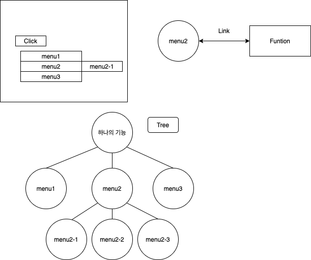
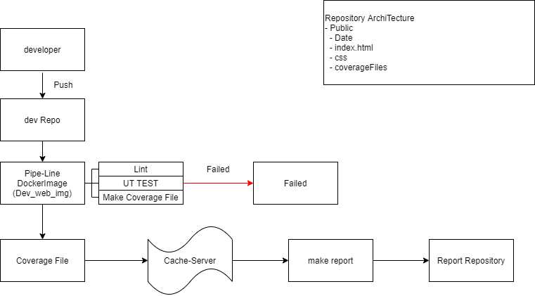
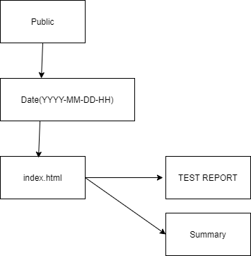
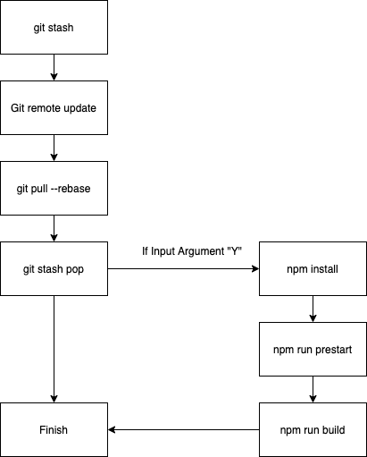
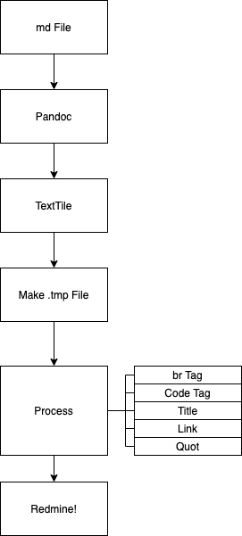
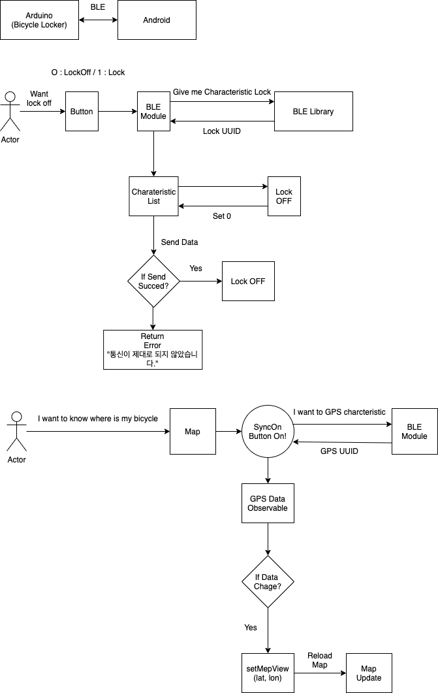

# 정승현의 지식 저장 공유소 깃허브에 오신걸 환영합니다. 👋

## History

* Suwon Uni. (2015/02)~(2021/02)
* Wins (co). (2020/08)~(2020/12) - Web Dev
* 코드스쿼드 (2021/01/04 ~ ) - 

## 사용 언어 및 프레임워크❗️❗️

**실무에서 사용한 언어 및 프레임워크**
**JavaScript(보통) TypeScript(보통) NodeJS(보통) NestJS(하) Angular(낮음) TypeORM(보통) Jest(중/상)**  

**지속적으로 중점적으로 공부중인 언어 및 프레임 워크**
**Java / Spring / JPA / NodeJS => (Spirng 에 대한 이해도가 높아지기 시작하면 짬을 내서 Deno 를 개인적으로 공부해볼까 생각중이다.)** 

## 실무에서 했던 일들 및 느낀점(2020/08/01 ~ 2020/12/31, 대학교 4학년 재학중 인턴 실습)

## 1. Angular Context-menu 개발

### 처음 입사시
처음 입사했을때, 면접을 당연히 Java 로 봤기에, Java 부서로 갈줄 알았는데 이게 왠걸.. JavaScript 를 이용하는 부서로 왔다. 생전 본적도 없는 코드들에 적응하기 힘들었지만, 선임님들의 코드를 본 덕분인지
꽤 빠르게 적응해 나갔다. 첫 과제로 Angular 를 통해서 Context menu 를 개발해야 했다. 회사에 반영된 코드는 현재 Context-menu 가 오류로 인해 중복으로 뜨는 버그가 있었다. 라이브러리 상의 문제였다.
그래서 라이브러리를 교체해야 했고, 나에게 해당 과제가 들어왔다. 그래서 Angular 를 공부하게 됬고, 5일 만에 겨우 완성했다. 빨리 만든지는 모르겠지만 요구사항과 확장성을 생각해서 개발해야 하기에 5일 정도 걸린것 같다. 이 프로젝트를 하면서 TypeScript 와 친해지게 되었고, 되게 재미있다는 생각이 들었다. 요구사항은 아래와 같았다.

### 요구사항

**1. 현재 라이브러리를 쓰고있는 컴포넌트에서 코드의 교체없이 있는 내 라이브러리를 넣기만 해도 반영이되어야 한다.**

**2. 함수를 호출할 수 있어야 한다.**

**3. 비활성화 시 빛바랜 회색(그당시 색코드가 있었는데 잘기억이안난다.)으로 표시되어야 한다.**

**4. 비활성화 여부는 개발자가 선택할 수 있어야 한다.**

**5. 기능에 따른 구분선이 필요하다.**

**6. img 파일을 앞에 붙일 수 있어야 한다.**

**7. selector 와 Input 을 이용하여 간단히 값만 넘겨도 작동하여야 했다.**

**8. 어떤 기능을 클릭한지 구분할 수 있어야 했다. 예를들면 휴지통에 오른쪽 마우스를 클릭하면 휴지통에 해당하는 기능을 자동으로 뽑아내야 했다.**

### 코드 설계

그래서 여러 라이브러리를 찾아보았고, 간단한 ng-context-menu 라는 라이브러리를 찾아서 해당 라이브러리를 Custom 한뒤 회사의 MenuData Form 인터페이스에 맞춰서 모듈화 시킨뒤, 전역에서 사용할 수 있도록
하였다. @Input Annotation 을 통해 MenuData 를 전달하도록 하였고, 해당 메뉴를 이용한 Context 들을 입력받아, 해당 함수와 Link 시켜 줄 수 있도록 하였다. 성공적으로 코드가 반영되었고 반영된 뒤 한번도 코드 수정을 하지 않았고, 버그도 발견되지 않았다. 해당 라이브러리를 통해 TypeScript 와 Angular 개발을 처음해보았는데, 되게 기분좋은 일이였다. 아래 코드 사용간 이용했던 설계도이다.

### 해당 코드 연습했던 깃허브 링크

- 연습용이라 간단히 라이브러리만 테스트한 수준이다. 회사 코드는 이와 많이 다르다..😭😭

[Context-menu Git](https://github.com/tmdgusya/angular-context-menu-library)

## 2. Jest FrameWork 를 통한 Test 및 Git-lab CI/CD Pipeline 을 통한 테스트 자동화 및 코드 검증

### 처음 입사시
내가 다니던 회사에서는 테스트 환경이 적절히 구성되어 있지 않았다. 회사에 처음 입사했을때, JavaScript 와 TypeScript 를 본격적으로 접했는데, 생각보다 자바의 신 문법들과 비슷해서 
배울만 했던것 같다. 특히 TypeScript 는 정말 친숙하기도 하고 맘에 들었다. 그래서 공부를 하다가 회사에서 테스트 환경을 구성하라는 업무를 받았고, Jest로 일단 백엔드 구간에 대한 테스트 코드들을 작성해 나갔다. 
남의 코드를 보면서 느꼈던 것들은, 일단 테스트 기반으로 작성된 코드들이 아니라, 함수가 잘게잘게 쪼개져 있지 않았다. 그래서 처음에는 테스트 하는데 되게 애를 먹었다. 
그래서 부분적으로 선임분들에게 해당 코드를 다른 방식으로 바꿔보는것이 어떨까란 이야기도 해봤고, 그래서 꽤 코드들도 수정되었다. 
회사에서는 테스트 환경을 본격적으로 처음 도입하는것인데, 생각보다 성과가 있는것에 놀라했다. 그래서 나에게 테스트 환경과 업무를 전담하여 맡게 했고, Jest 에 대한 공부를 하고, 효율적으로 셋팅할 수 있게 하려했다. 
### 고려사항
첫번째로 문제가 됬던 부분은 백엔드 구간의 코드가 노드의 실행 파일의 위치를 ROOT_PATH 로 잡는 것이 제일 큰 문제였다. 
회사에서는 테스트 환경을 기반으로 설계한것이 아니다보니, 테스트 수행시는 /root/node_module 의 위치를 따라가므로, 해당 루트를 자동으로 인식할 수 있게 해야 했다.  
그래서 Jest Setup.ts 파일을 생성하여, Jest 파일이 생성되기전, setRoot() Promise 함수를 통해, PATH 를 원하는 lib이 있는 경로로 인식하게 했다.  
근데 한가지 문제점이라면, docker 환경이 Build 될 시점 부터 Git Repository 를 Clone 하지 않아, /path/project 의 위치가 제각각 이였다. 그래서 테스트 환경이 정상적으로 작동하기 위해서는 
해당 ROOT_PATH 를 사용자가 설정할 수 있어야 했고, 이를 JEST 실행 전, setup 파일에 간단한 매개변수로 /path 부분만 넘기면 자동으로 설정하게 하였다. 
그리고 테스트 프레임워크를 적용하게 되면서 함수단위로 명확히 구분되는 코드가 중요하다는 것이 테스트 하기 쉽고, 테스트 하기 쉽다는 말은, 함수 단위의 작업 프로세스가 한가지로 명확해 질 수 있다는 점에서 앞으로 나도 코드를 적을때 함수단위로 명확하게 적어야겠다는 생각이 들었다. 

### Git-lab CI/CD 에서의 UT TEST
 
- 위와 같이 파이프라인을 설계하기로 마음먹었다. 기존에는 Lint 와 Build 과정만 진행했으나, UT TEST 를 진행하고, 해당 Report 파일을 Git-lab Cache-Server 에 올린 뒤, Report 하는 단계에서 해당 파일을 사용할 수 있게 하였다.

### CI/CD 문제점

- 이건 도커 환경의 문제였는데, 아무래도 테스트를 하지않다보니, 테스트 환경의 DB 를 개발서버와 똑같은 DB를 보고 있었다. 그래서 TEST 를 돌리는데 한명당 2\*N의 DB Connection 의 요구사항이 필요하게 되었고, 이는 자연스레 데이터베이스 서버의 부담감으로 작용했다. 그래서 회사에서 사용하고 있던 TypeORM 에 대해 공부했고, TypeORM 이 Default 로 Connection을 10개 가져간다는 사실을 알게되었다. 그래서 테스트 환경에서 Connection 에 대해 TEST 를 진행했고, 5개정도로 설정했을때 적당하다는 결과를 도출하게되었다.

## 3. Python Script 를 통한 테스트 Report HTML 생성 자동화

회사에서 테스트 업무를 맞게되면서 Git Repository 를 두가지로 구분하게 되었다. 개발 서버와, Test Report 를 따로 저장하는 일이였다.  
Dev Repo 에서 CI/CD pipeline 을 거친뒤, Jest 를 통한 UT TEST 후 해당 테스트 정보를 Test repository 에 Push 하도록 설계했다. 도식 정보는 아래와 같다.

위와 같이 설계 했으며, 개발 선임님의 요구사항은 report Repository 가 후에 다른 프로젝트로도 확장될 수 있으니, 다른 프로젝트로의 확장성도 고려해서 설계해달라하셨다.  
파이썬은 처음 접해보았지만 , 생각보다 쓸만했다. 사실 파이썬이라는거 자체의 고유 기능을 이용하기 보다는 JavaScript 처럼 설계한것 같다.  
그대로 최대한 클린코드 수칙에 맞게 함수단위로 기능을 구분하였고, 이름을 최대한 알 수 있도록 하기 위해 노력했다.  
그래서 Public 이라는 Folder 밑에 Project Name 이 들어가고 그 밑에 해당 날짜별 테스트 결과와 Summary 를 통한 Coverage 를 나타내도록 index.html 을 생성하였다.  
Test 결과는 Jest Framework 의 Collect Coverage 옵션을 통해 만들고, 해당 값을 Parsing 해와서 index.html 에 Summary 에 넣을 수 있도록 하였다.  

해당 파이썬 스크립트가 선임님의 검토를 받으면서 푸시되었고, 아 안써본 언어도 주어지면 해낼 수 있다는 자신감과, 확장성있게 잘 설계하여 회사의 테스트간 이용한다는 소리를 듣고 기분이 좋았다.

## 4. Shell Script 를 통한 업무 자동화

- 처음에 인턴으로 갔을때, 학교 실습생이다보니 1달정도의 관찰기간이 있었다고 한다. 그때는 거의 단순 반복 업무를 주로했었는데, 그때는 주로 스테이징 서버의 환경을 맡게되었다.  
근데 아무도 안쓰는 곳이다 보니 너무 불편한점이 많았다. 자동화 되야할 부분이 자동화 되어있지 않았고, 너무 수동으로 굴러간다는 느낌이 강했다.  
그래서 선임에게 이걸 자동화 시킬 방법이 없겠냐고 묻자, 선임이 나에게 **셸스크립트를** 추천해주었다. 
처음에는 이게 뭐지 난잡한 마음이였지만, 쓰다보니 강력한 능력을 지닌 언어라는것을 깨닫게 되었다. 그래서 서버의 On / off 기능을 자동으로 설정할 수 있도록 하고,

### Git 을 통한 코드 최신 업데이트의 자동화

를 위와 같이 설계 하였다. Y 혹은 Yes 를 입력하면 알아서 build 과정까지 진행했으며, 그 과정에서 DB Connection 의 정보도 입력할 수 있도록 하였다. sed 이용!  
이렇게 하기 싫은 귀찮은 일들도 자동화 할 수 있는 걸 알고 와 셸이란건 이렇게 보조적으로 알기만해도 정말 유용하다는 사실을 알게되었다.  

그러다 회사에서 팀장님이 Mdfile을 Redmine으로 대량으로 문서를 옮겨야 하는 일이 필요했고, 나에게 도움을 요청했다. 
기존에 있던 Pandoc 은 Textile 형태로는 바꿔주었으나, Redmine 에 맞게는 작성하지 못했고, 그래서 해당 과정을 수정해야 할 필요가 생겼다. 그래서 아래와 같은 설계도를 그렸다.

아래 깃허브에 코드가 적혀있다. 근데 Shell 을 자세하게 알지못하고, 코드를 적다보니 난잡한 부분이 있다. 빨리 옮겨야 하기 때문에 최대한 빨리짜느라 잘 설계하지 못했다.

[Shell Script 깃허브 링크](https://github.com/tmdgusya/MdfileConvertToRedmineDocs)

## 졸업 프로젝트 (한이음 프로젝트)

학교 졸업 프로젝트로, **스마트 자전거 자물쇠** 라는 주제로 프로젝트를 진행하게 되었다.  
안드로이드와 아두이노로 프로젝트를 진행하게 되었으며, 아두이노 생각보다 프로젝트를 진행하는데 큰 걸림돌이 되었다.. 

### 요구사항

**1. GPS 기능을 이용하여 추적기능이 활성화 되어야한다.**

**2. 로그인 기능을 통하여 회원이 로그인 할 수 있어야 한다.**

**3. BLE 를 통한 핸드폰과 블루투스 통신이 가능해야 한다.**

**4. 핸드폰을 통해 자물쇠를 열고 닫을 수 있어야 한다.**

### 코드설계

그 당시에는 잘한줄 알았으나, 지금 보기엔 포폴로 보여주기 부끄러운 코드이다. 간단하게 도식으로 어떤걸 만들려했는지 표시하겠다.

위 기능들은 전부 구현했으나, GPS 데이터를 가공해서 공적인 데이터로 이용하려는 부분은 실패했다. 일단 처음 접하는 아두이노가 생각보다 어려웠고,
BLE 통신이 Reference 가 많지 않아 우리가 원하는 방식대로 구현하는데 애를먹었다.. 이 과정을 진행하면서 진짜 BlueTooth 공식 싸이트에 메일을 보내보기도 했고, 실제로 Example 자료를 메일로 받았다.
그래서 그 Example 을 보면서 한달간 구현한 끝에 우리가 원하는 기능들을 좀 제대로 운영할 수 있었다.
사실 Map 에 GPS 를 Sync 해 내는 과정이 문제였는데, 회사에서 Observable 이라는 개념을 알게되면서 아 이거 값이 변경될 때 만 로딩시키자 해서
Observer 패턴으로 설계하진 못했지만, 유사하게 성공해 내서 마지막에 영상도 찍을 수 있었다.
물론 좀 지식이 없는 분야를 건드리다 보니, 클린 코드 및 에러를 잘 잡아내지 못했던 것 같다. 사실 학부생 때는 이런 에러처리에 대한 중요성을 알지 못했다.
실무에서 에러 처리는 반드시 되어 있어야 한다는 사실을 깨닫고, 나중에 시간날때 안드로이드 프로젝트는 리팩토링을 한번 진행해볼까 한다.
졸업프로젝트로 한이음 프로젝트를 진행해보면서 Git 도 Maintainer 로 관리하면서 조금 더 잘알게 된것 같다.
팀원들에게 Branch 별로 나눠서 푸시하도록 하고, 문제 부분은 Issue 처리하도록 하고, Code Review 후 Branch 내용을 Master 로 Push 했다.
이때 Rebase 를 이용했는데, 가지가 한줄로 나오니 보기도 편하고 좋았던 것 같다. 

그리고 프로젝트 종료 되고나서 여러가지 Git 전략을 살펴봤는데, BugFix 및 Build 여러가지로 브랜치 분기를 나눠서 사용하는것을 보았다.

다음 내 프로젝트에는 Git Branch 들을 특정 분기로 이용하여 해봐야 겠다는 생각이 들었다.

### 동영상

[Youtube 시연 동영상](https://www.youtube.com/watch?v=a3f2-FbZoG8)

## 코드스쿼드 마스터즈 코스 백엔드 과정(2021/01/06 ~ )

## 계속해서 해나갈 것들 && 공부중인 내용들 🧘🏻‍♂️

### 1일 1Commit 운동

* 매일 학습하며 점점 기술적으로 습득속도 그리고, 공부해야 되는게 더 많다고 느끼게 되어 계속해서 하고 있는 운동

### CS 기초이론 공부

* CS 기초 이론을 공부하다보면 기본적인 판단 능력을 배양해준다고 생각되어, 계속해서 구현하고 보강해나갈 예정

### Java Spring && JPA 공부

* 기초 원리 동작이나, 여러 실습등을 통한 공부 및 지속적인 프로젝트로 학습 예정
* 해당 과정에 대한 Git Repository 가 보존되어 있으며 Velog 에는 확실히 이해하고 응용할 수 있을 정도로 이해가 됬을때만 기술중이다.

### DB 공부

* Database 를 관리하고, WindowFunction 및 어떻게 운용해야 되는지 천천히 공부하고 정리하며 학습해나갈 예정

### JAVA 공부

* 지인과 스터디를 통해 서로 하나의 주제에 대해 준비해오고, 매주 토요일 세미나를 통해 서로 코드 보완 및 개념에 대한 공부
* 유튜브 백기선님 스터디 및 자바 책 계속 스터디
* 클린 코드 -> 깔끔하게 코드 적는법

## TIL

### 코드스쿼드
- [20210104 자바로 전가산기 설계 및 비트 연산기 설계](https://velog.io/@tmdgusya/%EC%BD%94%EB%93%9C%EC%8A%A4%EC%BF%BC%EB%93%9C-%EB%A7%88%EC%8A%A4%ED%84%B0%EC%A6%88-1%EC%9D%BC%EC%B0%A8-%ED%9A%8C%EA%B3%A02020-01-04)

### 백기선님 자바 스터디 참가
- [1주차 과제: JVM은 무엇이며 자바 코드는 어떻게 실행하는 것인가. #1](https://github.com/tmdgusya/TIL/blob/main/JavaStudyBKS/src/Week1/Week1.md)

### JPA 다시보기
- [JPA 등장 배경 및 영속성 컨텍스트](https://velog.io/@tmdgusya/JPA-%EB%93%B1%EC%9E%A5%EB%B0%B0%EA%B2%BD)

### Effective Java
- [정적 팩토리 메소드](https://github.com/tmdgusya/TIL/blob/main/EffectiveJava/Chapter01/FactoryMethod.md)

## 하고 싶은 것들

* OpenSource Project 참여!

# Velog 주소

<https://velog.io/@tmdgusya>

<!--
**tmdgusya/tmdgusya** is a ✨ _special_ ✨ repository because its `README.md` (this file) appears on your GitHub profile.
